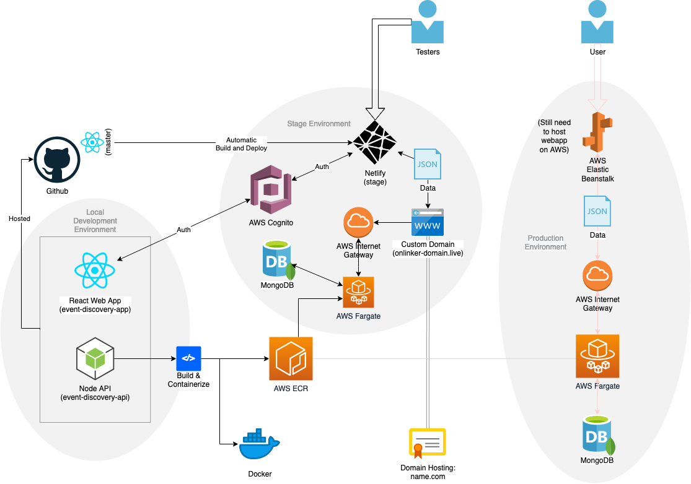

### Preamble?

The original app was intended to be a "virtual hosting and event discovery" web application that would allow nearby users to discover and participate in events that will eventually be hosted on the platform itself.

The original aoo is no longer active, and has been taken down.

This is a detached fork of the original repository for the backend API, which was almost entirely written by me. I realized there are many things in this codebase that could still potentially be re-used in future projects, or be used to reference and learn from.

Overall architecture of the app:

Enjoy :)

